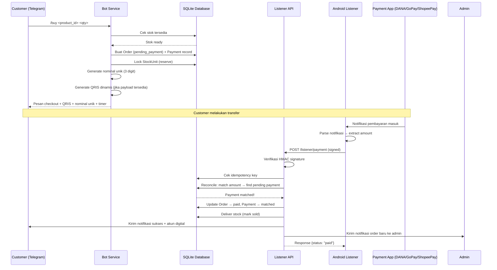
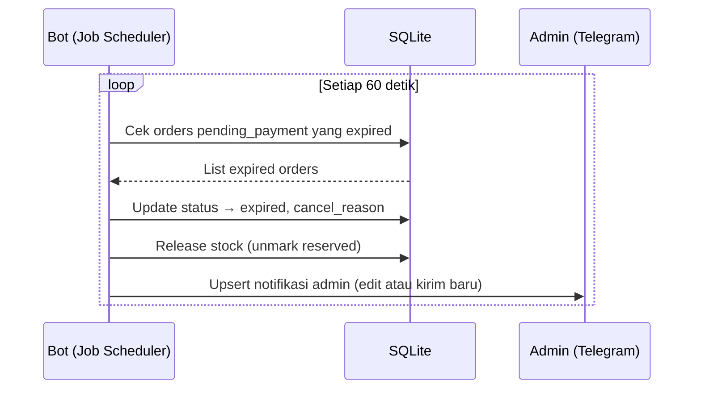
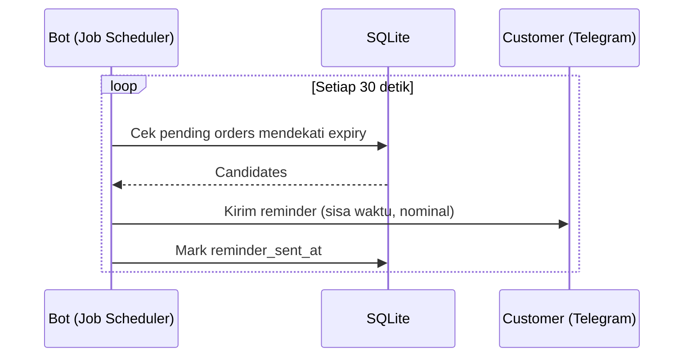
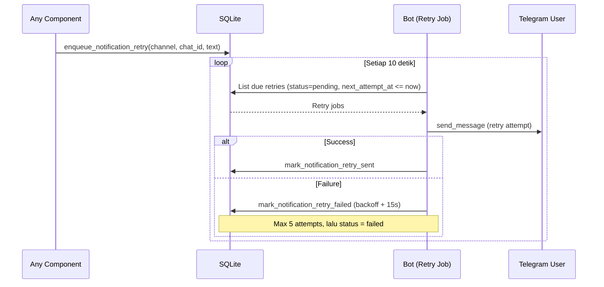
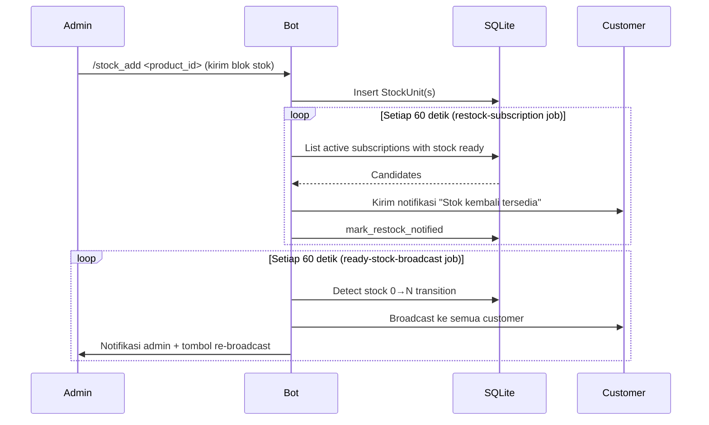
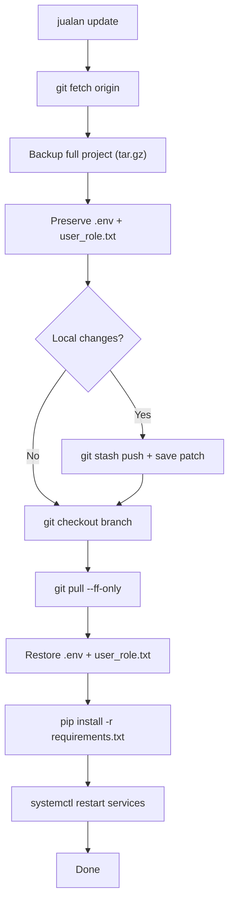

# 📦 Project Documentation — Bot Telegram Jualan

> **Versi Dokumen**: 1.0  
> **Terakhir Diperbarui**: 26 Mei 2026  
> **Bahasa Utama**: Python 3.12 (Backend), Dart/Flutter (Android Listener)

---

## Daftar Isi

1. [Ringkasan Proyek](#1-ringkasan-proyek)
2. [Arsitektur Sistem](#2-arsitektur-sistem)
3. [Desain Alur (Flow Design)](#3-desain-alur-flow-design)
4. [Aktor dan Peran](#4-aktor-dan-peran)
5. [Hierarki File dan Folder](#5-hierarki-file-dan-folder)
6. [Komponen Sistem](#6-komponen-sistem)
7. [Skema Database](#7-skema-database)
8. [API Kontrak](#8-api-kontrak)
9. [Sistem Keamanan](#9-sistem-keamanan)
10. [Background Jobs & Scheduler](#10-background-jobs--scheduler)
11. [Observability & Telemetry](#11-observability--telemetry)
12. [Operasi & Deployment](#12-operasi--deployment)
13. [CI/CD Pipeline](#13-cicd-pipeline)
14. [Konfigurasi Sistem](#14-konfigurasi-sistem)
15. [Kebutuhan Sistem](#15-kebutuhan-sistem)
16. [Roadmap & Status Fase](#16-roadmap--status-fase)

---

## 1. Ringkasan Proyek

**Bot Telegram Jualan** adalah sistem e-commerce berbasis Telegram Bot untuk penjualan produk digital. Sistem ini terdiri dari tiga komponen utama yang saling terintegrasi:

| Komponen | Teknologi | Fungsi |
|---|---|---|
| **Telegram Bot** | python-telegram-bot 21.4 | Antarmuka utama customer & admin via Telegram |
| **Payment Listener API** | FastAPI + Uvicorn | Menerima notifikasi pembayaran dari Android listener |
| **Android Notification Listener** | Flutter + Native Bridge | Menangkap notifikasi pembayaran di HP Android dan mengirim ke API |

### Fitur Utama

- **Katalog & Stok**: Manajemen produk digital dengan model 1 blok pesan = 1 unit stok
- **Checkout & Payment**: Nominal unik 3-digit, QRIS dinamis, timer expiry
- **Konfirmasi Pembayaran Otomatis**: Android listener → API → rekonsiliasi otomatis
- **Multi-Role RBAC**: Admin dan customer dengan dukungan database + file hybrid
- **Retry Queue**: Dead-letter queue untuk notifikasi gagal
- **Observability**: Telemetry terstruktur, metrik KPI on-demand
- **Self-Update**: Update, rollback, dan backup otomatis dari GitHub

---

## 2. Arsitektur Sistem

### 2.1 Arsitektur High-Level

```
┌─────────────────────────────────────────────────────────────────────┐
│                        VPS (Ubuntu 25)                              │
│                                                                     │
│  ┌──────────────────────┐       ┌──────────────────────────┐        │
│  │  jualan-bot.service  │       │  jualan-api.service      │        │
│  │  (Telegram Polling)  │       │  (FastAPI :8080)         │        │
│  │                      │       │                          │        │
│  │  ┌────────────────┐  │       │  POST /listener/payment  │        │
│  │  │ Handler Layer  │  │       │  POST /listener/test-con │        │
│  │  │ (Commands,     │  │       │  GET  /health            │        │
│  │  │  Callbacks,    │  │       │                          │        │
│  │  │  Messages)     │  │       └─────────┬────────────────┘        │
│  │  └───────┬────────┘  │                 │                         │
│  │          │            │                 │                         │
│  │  ┌───────▼────────┐  │       ┌─────────▼────────────────┐        │
│  │  │ Service Layer  │◄─┼───────┤ Reconciliation Engine    │        │
│  │  │ (Order, QRIS,  │  │       │ (Amount matching,        │        │
│  │  │  Catalog, etc) │  │       │  Idempotency,            │        │
│  │  └───────┬────────┘  │       │  Notification dispatch)  │        │
│  │          │            │       └─────────┬────────────────┘        │
│  │  ┌───────▼────────┐  │                 │                         │
│  │  │ Job Scheduler  │  │                 │                         │
│  │  │ (8 repeating   │  │                 │                         │
│  │  │  async jobs)   │  │                 │                         │
│  │  └───────┬────────┘  │                 │                         │
│  │          │            │                 │                         │
│  └──────────┼────────────┘                 │                         │
│             │                              │                         │
│      ┌──────▼──────────────────────────────▼──────┐                  │
│      │              SQLite Database               │                  │
│      │         data/bot_jualan.db                  │                  │
│      │    (WAL mode, busy_timeout=5000)            │                  │
│      └────────────────────────────────────────────┘                  │
│                                                                     │
│  ┌──────────────────────┐  ┌──────────────────────┐                  │
│  │ jualan-backup.timer  │  │ jualan-backup.service │                  │
│  │ (daily 02:00)        │→ │ (oneshot backup)      │                  │
│  └──────────────────────┘  └──────────────────────┘                  │
└─────────────────────────────────────────────────────────────────────┘
         ▲                              ▲
         │ Telegram API                 │ HTTPS POST
         │ (Polling)                    │ (Signed request)
         ▼                              │
┌─────────────────┐          ┌──────────┴──────────┐
│  Telegram Cloud  │          │  Android Device     │
│  (Bot API)       │          │  ┌────────────────┐ │
│                  │          │  │ Jualan Listener │ │
│                  │          │  │ (Flutter App)   │ │
│                  │          │  │                 │ │
│                  │          │  │ NotificationLis │ │
│                  │          │  │ tenerService    │ │
│                  │          │  └────────────────┘ │
└─────────────────┘          └─────────────────────┘
```

### 2.2 Arsitektur Layer (Backend Python)

```
┌─────────────────────────────────────────────┐
│               Entrypoint Layer              │
│  run_bot.py (Polling)  │  run_api.py (HTTP) │
├─────────────────────────────────────────────┤
│              Handler Layer                  │
│  bot/handlers/main.py  │  api/main.py       │
├─────────────────────────────────────────────┤
│              Service Layer                  │
│  order_service    │  catalog_service        │
│  qris_service     │  broadcast_service      │
│  metrics_service  │  complaint_service      │
│  backup_service   │  github_pack_service    │
│  notification_retry_service │ restock_service│
│  housekeeping_service  │  audit_service      │
│  user_service     │  stock_parser           │
│  settings_service │  restore_service        │
│  admin_order_notification_service           │
├─────────────────────────────────────────────┤
│              Common Layer                   │
│  config.py  │  roles.py  │  telemetry.py    │
│  logging.py                                 │
├─────────────────────────────────────────────┤
│              Data Layer                     │
│  database.py  │  models.py  │  bootstrap.py │
│  SQLAlchemy ORM  │  SQLite (WAL mode)       │
└─────────────────────────────────────────────┘
```

### 2.3 Pola Arsitektur

| Aspek | Pola |
|---|---|
| **Komunikasi Bot** | Long Polling (python-telegram-bot) |
| **API Framework** | FastAPI (async, Uvicorn) |
| **ORM** | SQLAlchemy 2.0 (Mapped columns, DeclarativeBase) |
| **Database** | SQLite dengan WAL mode + tuned pragmas |
| **Job Scheduling** | python-telegram-bot JobQueue (APScheduler) |
| **Configuration** | pydantic-settings (`.env` file binding) |
| **RBAC** | Hybrid database + file-based, with TTL cache |
| **Notification Retry** | Database-backed dead-letter queue |
| **Telemetry** | Structured logging + DB-persisted events |

---

## 3. Desain Alur (Flow Design)

### 3.1 Alur Checkout & Payment (Happy Path)



### 3.2 Alur Order Expired



### 3.3 Alur Payment Reminder



### 3.4 Alur Notification Retry (Dead-Letter Queue)



### 3.5 Alur Restock Notification



### 3.6 Alur QRIS Payment

```
┌────────────────────────────────────────────────────┐
│              QRIS Payment Flow                     │
│                                                    │
│  ┌──────────────┐    ┌──────────────────────────┐  │
│  │ Admin Upload  │    │ Sistem Auto-Extract      │  │
│  │ QRIS Image   │───>│ Payload dari Gambar QR   │  │
│  │ (pay:upload)  │    │ (OpenCV + QR decode)     │  │
│  └──────────────┘    └──────────┬───────────────┘  │
│                                 │                  │
│         atau                    ▼                  │
│                      ┌──────────────────────────┐  │
│  ┌──────────────┐    │ QRIS Static Payload      │  │
│  │ Admin Manual  │───>│ Stored in DB (BotSetting)│  │
│  │ pay:payload:  │    │                          │  │
│  │ set           │    └──────────┬───────────────┘  │
│  └──────────────┘               │                  │
│                                 ▼                  │
│                      ┌──────────────────────────┐  │
│  Saat Checkout ────> │ qris_service.py          │  │
│                      │ 1. Modify CRC payload    │  │
│                      │ 2. Insert amount tag     │  │
│                      │ 3. Generate QR image     │  │
│                      │ 4. Kirim ke customer     │  │
│                      └──────────────────────────┘  │
│                                                    │
│  Fallback: jika payload tidak tersedia,            │
│  kirim QRIS gambar statis (data/qris.png)          │
└────────────────────────────────────────────────────┘
```

---

## 4. Aktor dan Peran

### 4.1 Aktor Utama

| Aktor | Deskripsi | Autentikasi |
|---|---|---|
| **Customer** | Pengguna akhir yang membeli produk digital | Telegram User ID (auto-register) |
| **Admin** | Pengelola toko, manajemen produk & order | Telegram User ID di `user_role.txt` / DB |
| **Android Listener** | Aplikasi Android yang mengirim notifikasi pembayaran | HMAC-SHA256 Signed Headers |
| **System (Scheduler)** | Background jobs yang berjalan otomatis | Internal (no auth needed) |
| **Ops Operator** | Pengelola VPS yang mengoperasikan panel `jualan` | SSH Access ke VPS |

### 4.2 Matriks Interaksi Aktor ↔ Sistem

| Aktor | Channel | Interaksi |
|---|---|---|
| **Customer → Bot** | Telegram (Commands, Callbacks) | `/start`, `/catalog`, `/buy`, `/myorders`, `/order_status`, `/reorder` |
| **Admin → Bot** | Telegram (Commands, Callbacks, Menu) | Manajemen produk, stok, order, broadcast, QRIS, metrik, update |
| **Android Listener → API** | HTTPS POST | `/listener/payment`, `/listener/test-connection` |
| **API → Bot** | Telegram Bot API (send_message) | Kirim notifikasi ke customer dan admin setelah payment matched |
| **Scheduler → DB** | Direct DB access | Expire orders, reminder, retry notifications, housekeeping |
| **Ops → VPS** | Bash CLI (`jualan`) | Start/stop/restart, config, update, rollback, backup/restore |
| **GitHub Actions → CI** | Automated pipeline | Compile, smoke tests, E2E tests, perf gate |

### 4.3 Command Reference — Customer

| Command/Action | Deskripsi |
|---|---|
| `/start` | Menu utama + keyboard navigasi |
| `/catalog` | Lihat daftar produk tersedia |
| `/buy <product_id> <qty>` | Beli produk, mulai checkout |
| `/myorders` | Riwayat pesanan (paginated) |
| `/order_status <ORDER_REF>` | Cek status pesanan spesifik |
| `/reorder <ORDER_REF>` | Pesan ulang dari riwayat delivered |
| Callback `restock:sub:<id>` | Subscribe notifikasi restock |
| Callback `cp:<product_id>` | Detail produk |
| Callback `back:main` | Kembali ke menu utama |

### 4.4 Command Reference — Admin

| Command/Action | Deskripsi |
|---|---|
| `/admin_catalog` | Lihat katalog admin (termasuk suspended) |
| `/product_add Nama\|Harga\|Deskripsi` | Tambah produk baru |
| `/stock_add <product_id>` | Tambah stok (kirim blok teks) |
| `/product_suspend <product_id>` | Suspend produk |
| `/product_unsuspend <product_id>` | Unsuspend produk |
| `/product_delete <product_id>` | Hapus produk |
| `/broadcast <pesan>` | Broadcast ke semua customer |
| `/set_qris` | Upload gambar QRIS fallback |
| `/ops_metrics` | Laporan metrik operasional |
| `/update_check` | Cek update dari GitHub |
| `/update_apply` | Terapkan update |
| Menu `pay:upload` | Upload gambar QRIS + auto-extract payload |
| Menu `pay:payload:set` | Set QRIS payload statis manual |
| Menu `pay:status` | Cek kesiapan QRIS |
| Menu `📊 Laporan Operasional` | Dashboard KPI runtime |

---

## 5. Hierarki File dan Folder

```
bot_tele_jualan/
│
├── .env.example                 # Template variabel lingkungan
├── .gitignore                   # Git ignore rules
├── README.md                    # Dokumentasi ringkas proyek
├── ROADMAP_TODO.md              # Roadmap fase pengembangan
├── requirements.txt             # Dependensi Python
├── setup.sh                     # Script instalasi satu langkah (Ubuntu)
├── user_role.txt                # File role admin (fallback)
├── api documentation.txt        # Dokumentasi API QRIS Generator eksternal
├── project.md                   # ← Dokumen ini
│
├── src/                         # Source code utama (Python)
│   └── app/
│       ├── __init__.py
│       ├── run_bot.py           # Entrypoint: Telegram Bot (polling)
│       ├── run_api.py           # Entrypoint: FastAPI Listener
│       │
│       ├── api/                 # Modul API (FastAPI)
│       │   ├── __init__.py
│       │   ├── main.py          # Router, endpoint handler, reconciliation
│       │   ├── security.py      # HMAC signature, idempotency key
│       │   └── listener_events.py # Idempotency event tracking
│       │
│       ├── bot/                 # Modul Telegram Bot
│       │   ├── __init__.py
│       │   ├── app.py           # Application builder, job scheduler wiring
│       │   │
│       │   ├── handlers/        # Handler layer
│       │   │   ├── __init__.py
│       │   │   ├── main.py      # Semua command/callback/message handlers (~256KB)
│       │   │   └── backup_restore_helpers.py  # Helper backup/restore via Telegram
│       │   │
│       │   └── services/        # Service/business logic layer
│       │       ├── __init__.py
│       │       ├── order_service.py              # Order lifecycle, reconciliation, delivery
│       │       ├── catalog_service.py            # CRUD produk, stok, cache
│       │       ├── qris_service.py               # QRIS dinamis generator
│       │       ├── broadcast_service.py          # Broadcast ke semua customer
│       │       ├── metrics_service.py            # KPI, laporan metrik
│       │       ├── complaint_service.py          # Sistem komplain & refund
│       │       ├── github_pack_service.py        # Manajemen GitHub Pack
│       │       ├── notification_retry_service.py # Dead-letter retry queue
│       │       ├── restock_service.py            # Restock subscription
│       │       ├── housekeeping_service.py       # Cleanup data transient
│       │       ├── backup_service.py             # Backup/restore via bot
│       │       ├── restore_service.py            # Restore database via bot
│       │       ├── audit_service.py              # Audit log recording
│       │       ├── user_service.py               # User registration/lookup
│       │       ├── stock_parser.py               # Parser blok stok
│       │       ├── settings_service.py           # Key-value settings (BotSetting)
│       │       └── admin_order_notification_service.py  # Admin order upsert logic
│       │
│       ├── common/              # Shared utilities
│       │   ├── __init__.py
│       │   ├── config.py        # Pydantic Settings (46 konfigurasi)
│       │   ├── roles.py         # RBAC: hybrid file + database, cache TTL
│       │   ├── telemetry.py     # Structured telemetry logging + DB persistence
│       │   └── logging.py       # Logging configuration
│       │
│       └── db/                  # Database layer
│           ├── __init__.py
│           ├── models.py        # SQLAlchemy ORM models (15 tabel)
│           ├── database.py      # Engine, session factory, SQLite pragmas
│           └── bootstrap.py     # DDL migration, index creation, admin sync
│
├── data/                        # Runtime data (gitignored)
│   ├── bot_jualan.db            # Database utama SQLite
│   └── qris.png                 # Gambar QRIS fallback (jika ada)
│
├── ops/                         # Operasi & DevOps
│   ├── jualan                   # Panel CLI untuk manajemen service
│   ├── update_manager.sh        # Check/update/rollback dari GitHub
│   ├── backup_manager.sh        # Backup/restore/prune database
│   ├── e2e_local_test.py        # E2E integration test (lokal, tanpa Telegram)
│   ├── latency_smoke.py         # Bot handler latency smoke test
│   ├── perf_listener_smoke.py   # Listener API performance gate
│   ├── qa_copy_smoke.py         # UI copy/CTA consistency smoke test
│   ├── qa_phase1_manual.md      # Manual QA checklist Phase 1
│   │
│   ├── systemd/                 # Systemd unit files (template)
│   │   ├── jualan-bot.service   # Bot service unit
│   │   ├── jualan-api.service   # API service unit
│   │   ├── jualan-backup.service # Backup oneshot unit
│   │   └── jualan-backup.timer  # Daily backup timer (02:00)
│   │
│   └── backups/                 # Backup snapshots (gitignored)
│
├── android_listener/            # Flutter app: Android Notification Listener
│   ├── pubspec.yaml             # Flutter project config
│   ├── lib/
│   │   └── main.dart            # UI + MethodChannel bridge (~747 baris)
│   ├── android/                 # Native Android project
│   └── ...
│
└── .github/
    └── workflows/
        └── ci.yml               # GitHub Actions CI pipeline
```

---

## 6. Komponen Sistem

### 6.1 Bot Telegram (`src/app/bot/`)

**Entrypoint**: `run_bot.py` → `create_bot_application()` → `app.run_polling()`

| Sub-komponen | File | Fungsi |
|---|---|---|
| Application Builder | `app.py` | Konfigurasi bot, register handlers, setup 8 background jobs |
| Handler Layer | `handlers/main.py` | Semua command, callback, message, dan photo handlers |
| Backup Helpers | `handlers/backup_restore_helpers.py` | Helper upload/download backup via Telegram |

**Konfigurasi Bot Runtime:**
- `concurrent_updates`: 8 (parallel handler execution)
- `http_pool_size`: 32
- Connect/read/write timeout: 5/20/20 detik
- Slow handler threshold: 750ms

### 6.2 Payment Listener API (`src/app/api/`)

**Entrypoint**: `run_api.py` → Uvicorn → `app.api.main:app` (port 8080)

| Endpoint | Method | Fungsi |
|---|---|---|
| `/health` | GET | Health check |
| `/listener/payment` | POST | Terima notifikasi pembayaran, lakukan reconciliation |
| `/listener/test-connection` | POST | Test koneksi dari Android listener |

**Payment Reconciliation Engine:**
1. Validasi autentikasi (HMAC signature atau legacy secret)
2. Cek idempotency key (replay protection)
3. Match amount ke pending payment records
4. Update order status → paid
5. Deliver stock ke customer (kirim akun digital)
6. Notifikasi customer + admin via Telegram Bot API
7. Fallback ke retry queue jika notifikasi gagal

### 6.3 Android Listener (`android_listener/`)

**Teknologi**: Flutter (Dart) + MethodChannel ke native Android

| Fitur | Deskripsi |
|---|---|
| Konfigurasi Endpoint | Set URL API + shared secret |
| App Selection | Pilih aplikasi yang didengarkan (DANA, ShopeePay, GoPay, atau semua) |
| Lock-in Mode | Quick-select hanya DANA + ShopeePay + GoPay |
| Test Payload | Panel simulasi kirim payment payload |
| Background Mode | Foreground notification untuk keep-alive |
| Queue Management | Pending queue count + flush |
| Test Connection | Verifikasi koneksi ke API server |

**Native Bridge (MethodChannel):**
- `jualan_listener/native` channel
- Methods: `getConfig`, `setConfig`, `getInstalledApps`, `setSelectedApps`, `isListenerEnabled`, `openNotificationListenerSettings`, `testConnectionNative`, `enqueueTestPayload`, `enqueueFlush`, `getPendingQueueCount`, `lockToRecommendedApps`, `isKeepAliveForegroundEnabled`, `setKeepAliveForegroundEnabled`

### 6.4 Service Layer (`src/app/bot/services/`)

| Service | File | Fungsi Utama |
|---|---|---|
| **Order Service** | `order_service.py` (39KB) | Order lifecycle, checkout, payment reconciliation, delivery, expiry, reorder, upsell |
| **Catalog Service** | `catalog_service.py` (9KB) | CRUD produk, stok management, promote awaiting, TTL cache |
| **QRIS Service** | `qris_service.py` (9KB) | Generate QRIS dinamis, modify CRC, parse payload dari gambar |
| **Complaint Service** | `complaint_service.py` (20KB) | Sistem komplain, refund workflow, attachment management |
| **GitHub Pack Service** | `github_pack_service.py` (33KB) | Manajemen akun GitHub Pack, batch notification |
| **Metrics Service** | `metrics_service.py` (19KB) | KPI operasional, statistik payment, funnel analysis |
| **Broadcast Service** | `broadcast_service.py` (4KB) | Broadcast pesan ke semua customer |
| **Backup Service** | `backup_service.py` (10KB) | Backup via Telegram (upload/download) |
| **Restore Service** | `restore_service.py` (11KB) | Restore database via Telegram |
| **Notification Retry** | `notification_retry_service.py` (5KB) | Dead-letter queue: enqueue, list due, mark sent/failed |
| **Housekeeping** | `housekeeping_service.py` (2KB) | Cleanup data transient (listener events, retry jobs, telemetry) |
| **Restock Service** | `restock_service.py` (3KB) | Restock subscription management |
| **Audit Service** | `audit_service.py` (0.5KB) | Insert audit log entries |
| **User Service** | `user_service.py` (1.3KB) | User registration/lookup |
| **Stock Parser** | `stock_parser.py` (2KB) | Parse blok teks stok menjadi unit |
| **Settings Service** | `settings_service.py` (0.6KB) | Key-value settings CRUD |
| **Admin Order Notification** | `admin_order_notification_service.py` (2KB) | Upsert notifikasi admin order (edit existing atau kirim baru) |

### 6.5 Operations Panel (`ops/jualan`)

Panel CLI berbasis Bash untuk manajemen service di VPS:

```
jualan start              # Start bot + API service
jualan stop               # Stop services
jualan restart            # Restart services
jualan status             # Show systemd status
jualan logs               # Follow bot logs (journalctl)
jualan config             # Interactive: set BOT_TOKEN, secret, admin ID
jualan check-update       # Fetch + compare commit dengan origin
jualan update             # Full update workflow (backup → stash → pull → restore → restart)
jualan rollback           # Rollback ke commit sebelumnya
jualan backup             # Snapshot database sekarang
jualan list-backups       # List backup files
jualan restore-backup [f] # Restore dari file backup
jualan prune-backups [n]  # Keep N backup terbaru
jualan uninstall          # Disable services + remove alias
```

---

## 7. Skema Database

### 7.1 Entity Relationship Diagram

```mermaid
erDiagram
    USERS ||--o{ ORDERS : places
    USERS ||--o{ RESTOCK_SUBSCRIPTIONS : subscribes
    USERS ||--o{ COMPLAINT_CASES : files
    PRODUCTS ||--o{ STOCK_UNITS : has
    PRODUCTS ||--o{ RESTOCK_SUBSCRIPTIONS : tracked_by
    ORDERS ||--o{ ORDER_ITEMS : contains
    ORDERS ||--|| PAYMENTS : has
    ORDERS ||--o{ COMPLAINT_CASES : related_to
    COMPLAINT_CASES ||--o{ COMPLAINT_ATTACHMENTS : has

    USERS {
        int id PK
        bigint telegram_id UK
        string username
        string full_name
        string role "customer|admin"
        datetime created_at
        datetime last_seen_at
    }

    PRODUCTS {
        int id PK
        string name
        text description
        int price "dalam Rupiah"
        bool is_suspended
        datetime created_at
        datetime updated_at
    }

    STOCK_UNITS {
        int id PK
        int product_id FK
        text raw_text "konten akun digital"
        text parsed_json
        string stock_status "ready|awaiting|reserved"
        datetime available_at
        string username_key
        bool is_sold
        int sold_order_id FK
        datetime created_at
    }

    ORDERS {
        int id PK
        string order_ref UK "ORD2026..."
        int customer_id FK
        string status "pending_payment|paid|delivered|expired|cancelled"
        int subtotal
        int unique_code "3 digit nominal unik"
        int total_amount "subtotal + unique_code"
        datetime expires_at
        datetime cancelled_at
        text cancel_reason
        bigint checkout_chat_id
        bigint checkout_message_id
        datetime reminder_sent_at
        bigint admin_notify_chat_id
        bigint admin_notify_message_id
        datetime created_at
        datetime paid_at
        datetime delivered_at
    }

    ORDER_ITEMS {
        int id PK
        int order_id FK
        int product_id FK
        int quantity
        int unit_price
    }

    PAYMENTS {
        int id PK
        int order_id FK_UK
        string payment_ref UK
        int expected_amount
        int received_amount
        string source_app "DANA|GoPay|ShopeePay|..."
        string status "pending|matched"
        text payload_json
        datetime created_at
        datetime matched_at
    }

    RESTOCK_SUBSCRIPTIONS {
        int id PK
        int customer_id FK
        int product_id FK
        bool is_active
        datetime created_at
        datetime notified_at
    }

    NOTIFICATION_RETRY_JOBS {
        int id PK
        string channel "customer_delivery|admin_order|payment_reminder|..."
        bigint chat_id
        text payload_text
        string parse_mode
        string status "pending|sent|failed"
        int attempt_count
        int max_attempts "default 3"
        text last_error
        datetime next_attempt_at
        datetime created_at
        datetime sent_at
    }

    BROADCAST_LOGS {
        int id PK
        int admin_id FK
        text message
        int sent_count
        int failed_count
        datetime created_at
    }

    BOT_SETTINGS {
        string key PK
        text value
        datetime updated_at
    }

    AUDIT_LOGS {
        int id PK
        int actor_id FK
        string action
        string entity_type
        string entity_id
        text detail
        datetime created_at
    }

    UPDATE_HISTORY {
        int id PK
        string action "update|rollback"
        string previous_commit
        string new_commit
        string branch
        text note
        datetime created_at
    }

    LISTENER_EVENTS {
        int id PK
        string idempotency_key UK
        string request_hash
        string status "received|processed|failed"
        text response_json
        datetime created_at
        datetime processed_at
    }

    TELEMETRY_EVENTS {
        int id PK
        string event "api.payment_listener|job.expire_pending_orders|..."
        int duration_ms
        bool success
        string status
        text payload_json
        datetime created_at
    }

    COMPLAINT_CASES {
        int id PK
        string complaint_ref UK
        int customer_id FK
        bigint customer_telegram_id
        string customer_username_snapshot
        int order_id FK
        string order_ref_snapshot
        datetime order_created_at_snapshot
        text complaint_text
        string status "new|in_progress|refund_requested|..."
        text rejected_reason
        text refund_target_detail
        datetime refund_requested_at
        datetime refund_detail_received_at
        string refund_proof_file_id
        text refund_note
        datetime refund_transferred_at
        datetime closed_at
        datetime created_at
        datetime updated_at
    }

    COMPLAINT_ATTACHMENTS {
        int id PK
        int complaint_id FK
        string file_id
        datetime created_at
    }
```

### 7.2 Tabel Summary

| # | Tabel | Jumlah Kolom | Fungsi |
|---|---|---|---|
| 1 | `users` | 7 | Registrasi user (customer/admin) |
| 2 | `products` | 6 | Katalog produk digital |
| 3 | `stock_units` | 10 | Unit stok per produk |
| 4 | `orders` | 17 | Order dan lifecycle status |
| 5 | `order_items` | 5 | Item dalam order |
| 6 | `payments` | 9 | Record pembayaran |
| 7 | `restock_subscriptions` | 6 | Subscription notifikasi restock |
| 8 | `notification_retry_jobs` | 11 | Dead-letter retry queue |
| 9 | `broadcast_logs` | 5 | Log broadcast admin |
| 10 | `bot_settings` | 3 | Key-value settings runtime |
| 11 | `audit_logs` | 7 | Audit trail |
| 12 | `update_history` | 6 | Riwayat update/rollback |
| 13 | `listener_events` | 6 | Idempotency tracking API |
| 14 | `telemetry_events` | 7 | Telemetry data persisted |
| 15 | `complaint_cases` | 18 | Kasus komplain customer |
| 16 | `complaint_attachments` | 4 | Lampiran file komplain |

### 7.3 Index Optimization

Database bootstrap (`bootstrap.py`) membuat 18+ custom composite indexes untuk hot-path queries:

| Index | Kolom | Target Query |
|---|---|---|
| `ix_stock_units_status_unsold` | `(stock_status, is_sold)` | Filter stok ready |
| `ix_stock_units_product_ready_fifo` | `(product_id, is_sold, sold_order_id, stock_status, id)` | FIFO stock allocation |
| `ix_orders_pending_reminder` | `(status, expires_at, reminder_sent_at)` | Payment reminder candidates |
| `ix_orders_customer_id_desc` | `(customer_id, id DESC)` | My orders listing |
| `ix_payments_expected_status_created` | `(expected_amount, status, created_at)` | Payment reconciliation matching |
| `ix_retry_jobs_due` | `(status, next_attempt_at, attempt_count)` | Due retry job lookup |
| `ix_telemetry_events_event_created_duration` | `(event, created_at, duration_ms)` | Telemetry aggregation |
| ... | ... | ... |

---

## 8. API Kontrak

### 8.1 Payment Listener

```
POST /listener/payment
```

**Headers (wajib):**

| Header | Tipe | Deskripsi |
|---|---|---|
| `X-Signature` | string | HMAC-SHA256(secret, timestamp + "." + body) |
| `X-Timestamp` | string | Unix timestamp (detik) |
| `X-Idempotency-Key` | string | Key unik per request (max 128 char) |

**Request Body:**

```json
{
  "amount": 50123,
  "source_app": "DANA",
  "reference": "PAY-ORD2026...",
  "raw_text": "teks notifikasi mentah",
  "metadata": {}
}
```

**Response (sukses match):**

```json
{
  "status": "paid",
  "message": "Pembayaran berhasil dicocokkan",
  "matched_chat_id": 123456789,
  "idempotent_replay": false,
  "idempotency_key": "unique-key-123",
  "notify_sent": true,
  "notify_error": "",
  "admin_notify_sent": true,
  "admin_notify_error": ""
}
```

**Status Values:**

| Status | Deskripsi |
|---|---|
| `paid` | Payment berhasil di-match ke order |
| `not_found` | Tidak ada pending payment dengan amount tersebut |
| `ambiguous` | Lebih dari satu pending payment dengan amount sama |
| `error` | Error internal |

### 8.2 Test Connection

```
POST /listener/test-connection
```

**Response:**

```json
{
  "status": "ok",
  "message": "Koneksi listener valid",
  "server_time": 1748225012
}
```

### 8.3 Health Check

```
GET /health
```

**Response:**

```json
{
  "status": "ok"
}
```

### 8.4 External API — QRIS Generator

Sistem menggunakan API eksternal untuk generate QRIS dinamis:

```
POST https://qrisku.my.id/api
```

```json
{
  "amount": "10000",
  "qris_statis": "<QRIS_STATIC_PAYLOAD>"
}
```

---

## 9. Sistem Keamanan

### 9.1 Autentikasi API

**HMAC-SHA256 Signed Headers (Primary):**

```
message = X-Timestamp + "." + raw_body
signature = HMAC-SHA256(LISTENER_SHARED_SECRET, message)
```

- TTL check: `|now - timestamp| <= LISTENER_SIGNATURE_TTL_SECONDS` (default 300s)
- Signature verification: constant-time comparison (`hmac.compare_digest`)

**Legacy Secret (Fallback):**
- Diaktifkan via `LISTENER_ALLOW_LEGACY_SECRET=true`
- Secret dikirim dalam body JSON (`"secret": "..."`)

### 9.2 Idempotency Protection

- Setiap request `/listener/payment` wajib punya `X-Idempotency-Key`
- Key disimpan di tabel `listener_events`
- Jika key sudah ada: return cached response (tanpa re-processing)
- Jika key sama tapi body hash berbeda: return 409 Conflict
- Request hash: SHA-256 dari raw body

### 9.3 RBAC (Role-Based Access Control)

**Hybrid Mode:**
1. **File-based** (`user_role.txt`): Format `admin:<telegram_user_id>`
2. **Database-based** (`users.role`): Kolom role di tabel users
3. **Merger**: `RBAC_USE_DATABASE=true` + `RBAC_FALLBACK_TO_FILE=true` → union keduanya

**Cache:**
- TTL cache (`RBAC_CACHE_TTL_SECONDS=30`) untuk mengurangi DB/file reads
- Cache invalidation otomatis saat admin list diubah

---

## 10. Background Jobs & Scheduler

Bot menjalankan 8 repeating async jobs via python-telegram-bot `JobQueue`:

| # | Job Name | Interval | First Run | Fungsi |
|---|---|---|---|---|
| 1 | `promote-awaiting-stock` | 300s (5m) | 60s | Promosikan stok dari status `awaiting` ke `ready` |
| 2 | `expire-pending-orders` | 60s | 30s | Expiry orders yang melewati `expires_at` |
| 3 | `payment-reminder` | 30s* | 20s | Kirim reminder sebelum payment expired |
| 4 | `restock-subscription` | 60s | 25s | Notifikasi customer yang subscribe restock |
| 5 | `ready-stock-broadcast` | 60s | 35s | Broadcast otomatis saat stok 0→N |
| 6 | `github-saved-ready-batch-notify` | 60s | 40s | Batch notify admin untuk GitHub Pack ready |
| 7 | `notification-retry` | 10s* | 5s | Proses dead-letter retry queue |
| 8 | `housekeeping` | 360m* | 90s | Cleanup data transient (retention-based) |

> \* = configurable via `.env`

### Housekeeping Retention:

| Data | Default Retention |
|---|---|
| Listener Events | 30 hari |
| Retry Jobs (completed/failed) | 14 hari |
| Telemetry Events | 14 hari |

---

## 11. Observability & Telemetry

### 11.1 Telemetry Architecture

```
┌──────────────┐      ┌────────────────┐      ┌──────────────────┐
│  Application │─────>│  log_telemetry │─────>│  Logger (INFO)   │
│  Code        │      │  function      │      │  Structured JSON │
│              │      │                │      └──────────────────┘
│              │      │                │
│              │      │                │─────>┌──────────────────┐
│              │      │                │      │  TelemetryEvent  │
│              │      │                │      │  (SQLite table)  │
│              │      └────────────────┘      └──────────────────┘
└──────────────┘
```

### 11.2 Telemetry Events

| Event | Source | Data |
|---|---|---|
| `api.payment_listener` | API | duration_ms, status, source_app, notify_sent |
| `job.expire_pending_orders` | Scheduler | expired_count, upsert_success/failed |
| `job.payment_reminder` | Scheduler | candidate_count, sent_count, retry_enqueued |
| `job.restock_subscription` | Scheduler | candidate_count, sent_count |
| `job.ready_stock_broadcast` | Scheduler | event_count, customer_sent/failed |
| `job.notification_retry` | Scheduler | due_job_count, sent/failed count |
| `job.housekeeping` | Scheduler | deleted counts per category |
| `job.promote_awaiting_stock` | Scheduler | promoted_count |
| `bot.handler.*` | Bot | handler latency, slow handler detection |

### 11.3 Metrik Admin On-Demand

Via tombol `📊 Laporan Operasional` atau `/ops_metrics`:
- Payment match success/failure rate
- Checkout funnel (pending → paid → delivered)
- P95 listener latency
- P95 checkout latency
- Top error rate handlers
- Retry queue snapshot (pending, failed, sent 24h, top failed channels)
- Timeout rate

---

## 12. Operasi & Deployment

### 12.1 Target Environment

| Item | Spesifikasi |
|---|---|
| **OS** | Ubuntu 25 (server) |
| **Python** | 3.12+ |
| **Process Manager** | systemd |
| **Database** | SQLite (lokal, WAL mode) |
| **Network** | Internet (Telegram API, GitHub, qrisku.my.id) |

### 12.2 Systemd Services

| Service | Type | Deskripsi |
|---|---|---|
| `jualan-bot.service` | simple | Bot Telegram (long polling) |
| `jualan-api.service` | simple | FastAPI listener (port 8080) |
| `jualan-backup.service` | oneshot | Database backup |
| `jualan-backup.timer` | timer | Daily backup trigger (02:00) |

Semua service:
- `Restart=on-failure` + `RestartSec=5`
- Environment dari `.env` file
- `PYTHONPATH=<project>/src`

### 12.3 Update Workflow



### 12.4 Backup Strategy

| Aspek | Detail |
|---|---|
| **Otomatis** | Daily 02:00 via systemd timer |
| **Manual** | `jualan backup` atau via Telegram admin |
| **Format** | SQLite file copy (atau `sqlite3 .backup`) |
| **Lokasi** | `ops/backups/botdb_YYYYMMDD_HHMMSS.sqlite3` |
| **Pre-restore** | Snapshot otomatis sebelum restore |
| **Pruning** | `jualan prune-backups [N]` (default keep 14) |
| **Update backup** | Full tar.gz sebelum setiap update |

---

## 13. CI/CD Pipeline

### 13.1 GitHub Actions Workflow

File: `.github/workflows/ci.yml`

```
Trigger: push (main/master) + pull_request

Job 1: smoke-and-e2e
  ├── Checkout code
  ├── Setup Python 3.12
  ├── Install dependencies
  ├── Compile source (compileall)
  ├── Copy smoke test (qa_copy_smoke.py)
  └── Local E2E test (e2e_local_test.py)

Job 2: perf-listener-gate (depends on Job 1)
  ├── Checkout + Setup + Install
  └── Listener performance smoke gate
      ├── PERF_SMOKE_REQUESTS=120
      ├── PERF_SMOKE_WARMUP=20
      └── PERF_SMOKE_P95_MS=400 (threshold)
```

### 13.2 Test Suite

| Test | File | Deskripsi |
|---|---|---|
| E2E Local | `ops/e2e_local_test.py` (34KB) | Full order lifecycle tanpa Telegram (pending → paid → delivered, expiry, pagination) |
| Copy Smoke | `ops/qa_copy_smoke.py` (2KB) | Verifikasi konsistensi UI copy/CTA di kode handler |
| Perf Smoke | `ops/perf_listener_smoke.py` (6KB) | Load test listener API, assert p95 < 400ms |
| Latency Smoke | `ops/latency_smoke.py` (6KB) | Bot handler latency profiling |
| QA Manual | `ops/qa_phase1_manual.md` (3KB) | Checklist manual QA untuk Telegram live |

---

## 14. Konfigurasi Sistem

### 14.1 Environment Variables (46 variabel)

Disimpan di `.env`, dimuat oleh `pydantic-settings`:

| Kategori | Variabel | Default | Deskripsi |
|---|---|---|---|
| **Core** | `BOT_TOKEN` | _(wajib)_ | Token Telegram Bot |
| | `DATABASE_URL` | `sqlite:///./data/bot_jualan.db` | Connection string database |
| | `USER_ROLE_FILE` | `./user_role.txt` | Path file role admin |
| **Listener Auth** | `LISTENER_SHARED_SECRET` | `change-me` | Shared secret untuk HMAC |
| | `LISTENER_SIGNATURE_TTL_SECONDS` | 300 | TTL validitas signature |
| | `LISTENER_ALLOW_LEGACY_SECRET` | false | Izinkan autentikasi via body secret |
| | `LISTENER_REQUIRE_REFERENCE` | false | Wajibkan field reference |
| **Payment** | `LISTENER_PAYMENT_MATCH_WINDOW_MINUTES` | 60 | Window waktu matching payment |
| | `CHECKOUT_EXPIRY_MINUTES` | 5 | Waktu expiry checkout |
| | `PAYMENT_REMINDER_MINUTES_BEFORE_EXPIRY` | 2 | Kirim reminder N menit sebelum expiry |
| | `PAYMENT_REMINDER_JOB_INTERVAL_SECONDS` | 30 | Interval job reminder |
| **Retry** | `NOTIFICATION_RETRY_MAX_ATTEMPTS` | 5 | Maksimum retry notifikasi |
| | `NOTIFICATION_RETRY_BACKOFF_SECONDS` | 15 | Backoff antar retry |
| | `NOTIFICATION_RETRY_JOB_INTERVAL_SECONDS` | 10 | Interval job retry |
| | `NOTIFICATION_RETRY_BATCH_SIZE` | 50 | Batch size per run |
| **Bot Tuning** | `BOT_CONCURRENT_UPDATES` | 8 | Parallel handler execution |
| | `BOT_HTTP_POOL_SIZE` | 32 | HTTP connection pool |
| | `BOT_CONNECT_TIMEOUT_SECONDS` | 5 | Connect timeout |
| | `BOT_READ_TIMEOUT_SECONDS` | 20 | Read timeout |
| | `BOT_WRITE_TIMEOUT_SECONDS` | 20 | Write timeout |
| | `BOT_POOL_TIMEOUT_SECONDS` | 5 | Pool timeout |
| | `BOT_HANDLER_SLOW_MS` | 750 | Threshold slow handler |
| | `BOT_HANDLER_TELEMETRY_SAMPLE_RATE` | 1.0 | Telemetry sampling rate |
| **Telemetry** | `TELEMETRY_ENABLED` | true | Enable/disable telemetry |
| | `TELEMETRY_PERSIST_ENABLED` | true | Persist ke DB |
| | `TELEMETRY_RETENTION_DAYS` | 14 | Retention telemetry data |
| **Housekeeping** | `HOUSEKEEPING_ENABLED` | true | Enable auto cleanup |
| | `HOUSEKEEPING_INTERVAL_MINUTES` | 360 | Interval cleanup (6 jam) |
| | `LISTENER_EVENT_RETENTION_DAYS` | 30 | Retention listener events |
| | `RETRY_JOB_RETENTION_DAYS` | 14 | Retention retry jobs |
| **Metrics** | `METRICS_REPORT_ENABLED` | false | Enable laporan terjadwal |
| | `METRICS_REPORT_WINDOW_HOURS` | 24 | Window laporan |
| | `METRICS_REPORT_INTERVAL_MINUTES` | 60 | Interval kirim laporan |
| | `METRICS_REPORT_SEND_TO_ADMIN` | true | Kirim ke admin |
| **RBAC** | `RBAC_USE_DATABASE` | true | Gunakan DB untuk role |
| | `RBAC_FALLBACK_TO_FILE` | true | Fallback ke file |
| | `RBAC_CACHE_TTL_SECONDS` | 30 | Cache TTL role |
| **Cache** | `CATALOG_CACHE_TTL_SECONDS` | 3 | Cache TTL katalog |
| **Display** | `DISPLAY_TIMEZONE` | `Asia/Jakarta` | Timezone tampilan |
| **QRIS** | `QRIS_IMAGE_PATH` | `./data/qris.png` | Path gambar QRIS fallback |
| | `QRIS_DYNAMIC_ENABLED` | true | Enable QRIS dinamis |
| **Update** | `GITHUB_REPO_URL` | `https://github.com/dalifajr/bot-jualan.git` | Repo GitHub |
| | `UPDATE_BRANCH` | _(auto detect)_ | Branch untuk update |
| **Other** | `GITHUB_PACK_NAME` | `GitHub Student Developer Pack` | Nama produk GitHub Pack |
| | `PYTHONPATH` | `./src` | Python path |

---

## 15. Kebutuhan Sistem

### 15.1 Kebutuhan Server (VPS)

| Item | Minimum | Rekomendasi |
|---|---|---|
| **OS** | Ubuntu 22.04+ | Ubuntu 25.04 |
| **CPU** | 1 vCPU | 2 vCPU |
| **RAM** | 512 MB | 1 GB |
| **Storage** | 5 GB | 10 GB |
| **Python** | 3.12+ | 3.12+ |
| **Network** | Outbound: Telegram API, GitHub | + Inbound: port 8080 (listener API) |
| **System** | systemd | systemd |

### 15.2 Dependensi Python

| Package | Versi | Fungsi |
|---|---|---|
| `python-telegram-bot` | 21.4 | Telegram Bot framework |
| `APScheduler` | 3.10.4 | Job scheduling (via PTB) |
| `fastapi` | 0.115.0 | REST API framework |
| `uvicorn[standard]` | 0.30.6 | ASGI server |
| `SQLAlchemy` | 2.0.44 | ORM database |
| `pydantic-settings` | 2.5.2 | Configuration management |
| `python-dotenv` | 1.0.1 | .env file loading |
| `qrcode` | 7.4.2 | QR code generation |
| `opencv-python-headless` | 4.13.0.92 | QR code reading dari gambar |

### 15.3 Kebutuhan Android Listener

| Item | Minimum |
|---|---|
| **Flutter SDK** | ≥ 3.3.0, < 4.0.0 |
| **Android** | API 21+ (Android 5.0) |
| **Permission** | `NotificationListenerService` |
| **Network** | HTTPS ke VPS (port 8080) |

### 15.4 SQLite Configuration

| Pragma | Value | Alasan |
|---|---|---|
| `journal_mode` | WAL | Concurrent reads + writes |
| `synchronous` | NORMAL | Balance durability + performance |
| `busy_timeout` | 5000ms | Avoid lock errors |

---

## 16. Roadmap & Status Fase

### Fase 1 ✅ — UX and Interface Foundation
- Standardisasi copy customer/admin
- Payment timeline + reminder
- Self-service order status
- E2E verification (lokal + manual)
- Reusable pagination pattern

### Fase 2 ✅ — Conversion and Retention
- Quick reorder dari riwayat
- Rekomendasi produk (upsell/cross-sell)
- Restock subscription + notifikasi
- Campaign repeat order (voucher/loyalti)

### Fase 3 ✅ — Reliability, Security, and Ops Scale
- Retry queue (dead-letter) untuk notifikasi
- Migrasi role admin ke database (hybrid)
- Backup otomatis + prosedur restore
- Metrik operasional terjadwal

### Fase 4 ✅ — Efficiency, Performance, and Interface Ops
- Telemetry terstruktur untuk jalur kritis
- Runtime KPI on-demand di panel admin
- Snapshot retry queue on-demand
- Housekeeping terjadwal
- Perf smoke gate CI pipeline
- Optimasi query hot-path (reduce N+1)

---

> **Catatan Penting:**
> - Database default SQLite cocok untuk fase awal (single-server).
> - Untuk trafik tinggi disarankan migrasi ke PostgreSQL.
> - Android listener sudah memiliki scaffold Flutter + native bridge; implementasi `NotificationListenerService` native masih tahap lanjutan.
